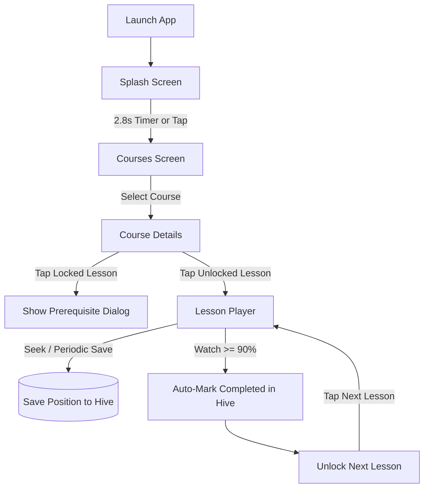
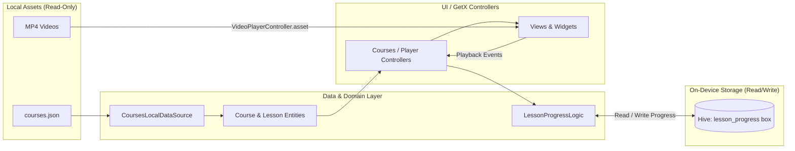
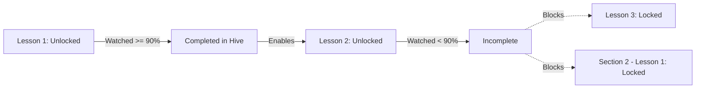

# Thaheen — Mini Offline LMS

Thaheen (ذاهين) is an offline-first, Arabic-first mobile Learning Management System (LMS) developed with Flutter for a screening task. It allows medical students to browse accredited courses, track progress, watch bundled lectures, and progress through sequential modules completely offline without an external backend.

<div align="center">

| Courses Dashboard | Course Syllabus | Lesson Player |
| :---: | :---: | :---: |
|  |  |  |

</div>

---

## Overview

The application satisfies all core screening requirements for an offline medical education platform:
* **Zero Backend Requirement**: Course structure, metadata, and media are bundled locally in the application binary.
* **Persistent Progress**: Lesson timestamps and completion states persist across app restarts using Hive key-value storage.
* **Academic Integrity Rules**: Lessons must be watched to at least 90% before the subsequent lesson unlocks.
* **Bilingual Arabic/English**: Defaults to Arabic RTL with Cairo typography; toggles seamlessly to English LTR at runtime.

---

## Key Features

### Core Requirements
* **Offline Bundled Content**: Pre-seeded with 2 courses, 4 sections, and 8 lessons loaded from `assets/data/courses.json`.
* **Bundled Video Playback**: 3 local MP4 video lectures under `assets/videos/` (all under 10 MB).
* **Course Listing**: Displays course cards with thumbnails, localized titles, instructors, lesson counts, and aggregate progress.
* **Continue Watching**: Automatically detects and surfaces the active in-progress lesson from local storage.
* **Sequential Lesson Unlocking**: Lessons unlock one after another; cross-section progression is strictly enforced.
* **Lesson Status Indicators**: Three distinct states: Not Started, In Progress, and Completed.
* **Locked Lesson Guard**: Tapping a locked tile blocks navigation and presents a localized modal dialog.
* **Video Player Controls**: Play/pause, 10s seek forward/rewind, interactive timeline scrubber, current time, and total duration.
* **Variable Playback Speed**: 1.0x, 1.25x, 1.5x, and 2.0x speeds applied directly to the video controller.
* **Position Resume**: Playback position is periodically and automatically saved to disk, resuming upon return.
* **90% Completion Rule**: Automatically completes the lecture and unlocks the next lesson once 90% duration is reached.
* **Next Lesson Action**: In-player button navigates sequentially to the next unlocked lecture.
* **Safe Offline Startup**: Connectivity checks are non-blocking; the app starts up and navigates without internet.

### Bonus Features
* **Course Search & Specialty Filtering**: Filter courses by clinical disciplines (Anatomy, Physiology, Biochemistry, Pharmacology).
* **Dark Mode Theme Support**: Full dark palette tokens (`AppTheme.darkTheme`) and `ThemeController` integration.
* **Per-Lesson Notes UI**: *(Partial)* Notes tab and note-taking action in the player overlay (UI implemented; database persistence deferred).

---

## App Screens

The screenshots below are captured from the actual running application and stored under `assets/ui-scrren/`.

### 1. Splash Screen & Offline Readiness

<p align="center">
  
</p>

* **Purpose**: Welcomes the student, verifies offline database readiness, and navigates into the learning portal.
* **Elements Visible**: Pulsing brand logo, academic specialization badges (Medicine, Nursing, Pharmacy, Prep), synchronization indicator (`جاهزية التزامن المحلي 100%`), and language switcher.
* **Behavior**: Automatically transitions to Courses after a 2.8s delay or immediately via the manual "الدخول إلى الفضاء التعليمي" button. Startup connectivity check runs asynchronously and never freezes the splash.

---

### 2. Courses Dashboard

<p align="center">
  
</p>

* **Purpose**: Primary dashboard for enrolled coursework and active study sessions.
* **Elements Visible**: 
  * Header with student profile, online/offline sync status pill, and instant language switch button.
  * Search bar with medical discipline filter chips (All, Anatomy, Physiology, Biochemistry, Pharmacology).
  * Course cards showing thumbnails, department badges (`طب بشري`), instructor names, total lessons (`4 دروس`), and visual progress bars (`100%`, `50%`).
  * Dynamic "Continue Watching" card that appears when an in-progress lesson is detected.

---

### 3. Course Details & Syllabus

<div align="center">

| Course Summary Header | Complete Syllabus & Lock States |
| :---: | :---: |
|  |  |

</div>

* **Purpose**: Syllabus breakdown displaying course modules, lecture durations, and sequential locking status.
* **Elements Visible**:
  * Hero card with instructor credentials, total clinical hours (`16 ساعة`), lecture count (`4 محاضرة مسجلة`), and circular percentage ring (`100%`).
  * Sequential learning rule banner informing students of the 90% watch-time requirement.
  * Section groupings (`مقدمة في علم التشريح`, `الجهاز الهيكلي`) with duration stamps and individual status badges (`مكتمل`, `محفوظة في Hive`).
* **Interaction**: Unlocked lessons navigate to the player; locked lessons trigger an alert modal.

---

### 4. Lesson Player & Speed Controls

<div align="center">

| Video Player Overlay | Playback Speed Selector (Landscape) |
| :---: | :---: |
|  |  |

</div>

* **Purpose**: Dedicated offline lecture player with playback controls, progress persistence, and syllabus navigation.
* **Elements Visible**:
  * Full controls overlay: 10s skip backward/forward, play/pause, 1080p asset badge, and fullscreen toggle.
  * Interactive progress scrubber displaying current time, total duration, and a dedicated **90% threshold milestone flag**.
  * Green completion notification (`تم إكمال الدرس بنجاح 100%`) displayed once 90% watch time is achieved.
  * Bottom sheet speed selector with 1.0x, 1.25x, 1.5x, and 2.0x rates, fitted for landscape and portrait without overflow.
  * "Next Lesson" (`الدرس التالي: مستويات الجسم`) shortcut enabled sequentially.

---

## Technical Flows

### 1. User Flow


### 2. Offline Data Flow


### 3. Sequential Unlock Logic


---

## Architecture

The project follows a **Feature-First Clean Architecture** design:

```text
lib/
├── config/              # Design tokens (StitchColors), theme, route names
├── core/                # Cross-cutting services (Network, Storage), translations, widgets
├── features/
│   ├── courses/         # Course list, continue watching, search, domain models & logic
│   │   ├── data/        # CoursesLocalDataSource, LessonProgressLocalDataSource
│   │   ├── domain/      # Course/Lesson entities, lesson_progress_logic.dart
│   │   └── presentation/# CoursesScreen, CoursesController, CourseCard
│   ├── course_details/  # Syllabus sections, lesson tile, locked dialog
│   ├── lesson_player/   # VideoPlayerScreen, player controls, speed bottom-sheet
│   └── splash/          # Splash screen, pulse logo, sync readiness card
├── app.dart             # GetMaterialApp configuration and routing table
├── di.dart              # Local dependency injection and Hive box initialization
└── main.dart            # Flutter main entry point
```

* **Data Layer**: Reads local JSON assets via `rootBundle` and executes read/write operations against Hive boxes.
* **Domain Layer**: Contains plain Dart entities (`Course`, `Section`, `Lesson`), status enums, and pure business algorithms (`lesson_progress_logic.dart`) with zero Flutter dependencies.
* **Presentation Layer**: Decomposed into modular widgets, responsive views, and reactive GetX controllers.

---

## Technical Decisions

| Area | Choice | Reason |
| :--- | :--- | :--- |
| **Framework** | Flutter 3.29 / Dart 3.6 | Null-safe, high-performance cross-platform rendering |
| **State Management** | GetX (`get: ^4.6.6`) | Lightweight reactive state (`Rx`/`Obx`), routing, and localization without boilerplate |
| **Local Persistence** | Hive (`hive: ^2.2.3`) | Fast pure-Dart NoSQL key-value store; zero SQLite overhead for local progress |
| **Video Player** | `video_player: ^2.11.1` | Official Flutter plugin for stable local asset MP4 playback |
| **Data Source** | Bundled Local JSON | Strictly satisfies the offline-first requirement with zero remote API dependencies |
| **Localization** | GetX Translations + Flutter RTL | Native Arabic RTL layout with dynamic runtime toggle to English LTR |

---

## Assignment Coverage

| Area | Requirement | Implementation Details | Verified Status |
| :--- | :--- | :--- | :---: |
| **Data** | 2 offline courses, 2 sections each | `assets/data/courses.json` (Anatomy & Biology; 8 lessons total) | Pass |
| **Media** | 2–3 bundled MP4s under 10 MB | `assets/videos/` (2.6 MB, 2.5 MB, 8.0 MB; all under 10 MB) | Pass |
| **Progress** | 90% auto-completion rule | `hasReachedCompletionThreshold()` in `lesson_progress_logic.dart` | Pass |
| **Unlocking** | Strict sequential unlock | `isLessonUnlocked()` in `lesson_progress_logic.dart` | Pass |
| **Persistence** | Restart-safe progress storage | `LessonProgressLocalDataSourceImpl` using Hive | Pass |
| **Localization** | Arabic-first default + RTL | `AppTranslations`, Cairo font, explicit LTR timestamp direction | Pass |
| **Player** | Controls, variable speed, resume | `LessonPlayerController` with 1x, 1.25x, 1.5x, 2x speeds | Pass |
| **Testing** | Unit tests for business logic | `lesson_progress_logic_test.dart` (46 tests total across suites) | Pass |

---

## States & Edge Case Handling

| State / Edge Case | Handling Mechanism |
| :--- | :--- |
| **Loading State** | Shimmer placeholder (`CoursesLoadingShimmer`) displayed while reading JSON and storage. |
| **Empty State** | User-friendly empty placeholder (`CoursesEmptyState`) if course list is empty. |
| **Video / Player Error** | Catches initialization failures safely and displays `LessonPlayerErrorView` with a retry button; avoids red-screen crashes. |
| **Locked Lesson Tap** | Intercepted in controller; opens `LockedLessonDialog` explaining prerequisite requirement. |
| **Offline Startup** | Connectivity detection runs asynchronously without blocking splash navigation; app functions 100% offline. |
| **Landscape Overflow** | Playback speed bottom sheet adapts constraints dynamically in landscape mode to prevent RenderFlex overflows. |

---

## Testing

The test suite validates pure domain business rules in complete isolation from Flutter UI widgets.

```bash
flutter test
```

### Verified Test Results: **46 / 46 Passed**
* **90% Completion Rule** (`lesson_progress_logic_test.dart`): 9 tests verifying exact boundary thresholds (89% fails, 90% passes, 95% passes, 100% passes, zero duration, and malformed inputs).
* **Sequential Unlock Rule** (`lesson_progress_logic_test.dart`): 8 tests verifying first lesson unlocked, subsequent locked, sequential progression, non-skipping, and cross-section unlocking.
* **Course Progress Calculation** (`lesson_progress_logic_test.dart`): 7 tests verifying 0%, 25%, 50%, 75%, 100%, and empty course edge cases.
* **Continue Watching Detection** (`lesson_progress_logic_test.dart`): 5 tests verifying accurate selection of active in-progress lectures.
* **Lesson Status Transitions** (`lesson_progress_logic_test.dart`): 5 tests validating status evaluation.
* **Localization & Locale Resolution** (`app_translations_test.dart`): 7 tests verifying bilingual parity and fallback behavior.
* **Widget & Network Tests** (`connectivity_banner_widget_test.dart`, `network_service_test.dart`): 5 tests verifying UI presentation.

---

## Getting Started

### Prerequisites
* Flutter SDK `^3.29.0`
* Dart SDK `^3.6.1`
* Android Studio / VS Code with Flutter extension

### Build & Run Commands

```bash
# 1. Install dependencies
flutter pub get

# 2. Verify static analysis (0 issues)
flutter analyze lib/ test/

# 3. Run all unit and widget tests (46 passing)
flutter test

# 4. Run application on connected device/emulator
flutter run

# 5. Build production release APK
flutter build apk --release
```

*The generated release APK is located at:* `build/app/outputs/flutter-apk/app-release.apk`

---

## Trade-offs & Known Limitations

* **Bundled Asset Scope**: All course metadata and MP4 videos are packaged directly into the APK for zero-network reliability. Dynamic remote downloading is outside the screening assignment scope.
* **Preset Playback Speeds**: Playback rates are restricted to discrete values (`1.0x`, `1.25x`, `1.5x`, `2.0x`) rather than a continuous slider.
* **Per-Lesson Notes**: The note-taking UI is integrated into the lesson player overlay, but notes are not persisted to a dedicated database box.
* **Network Interface Check**: `connectivity_plus` reports interface status (Wi-Fi/cellular) rather than verified internet/DNS reachability. Because the app is designed to run offline, network state never halts the user.

---

## What I Would Do With More Time

* Add a dedicated Hive box for persisting student notes per lesson with Markdown formatting.
* Expand widget test coverage with golden tests for Arabic RTL and English LTR layouts.
* Implement picture-in-picture (PiP) background playback for clinical video lectures.
* Add an optional background sync module to download new course packages when Wi-Fi is detected.

---

## Time Spent

Approximately 4–6 hours total across project setup, offline data architecture, Hive integration, video player controls, Stitch medical UI implementation, bilingual localization, and test suite verification.

